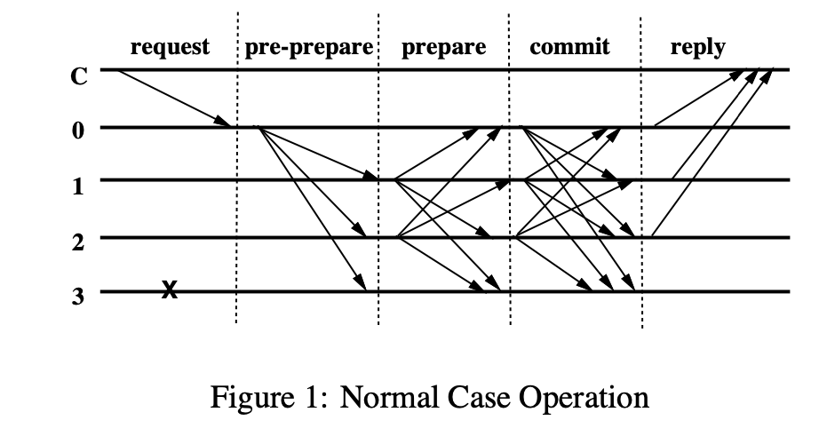

## 参考
- [pBFT算法的关键设计，你可能忽视了](https://learnblockchain.cn/article/2384)
- [详解实用拜占庭协议PBFT](https://learnblockchain.cn/2019/08/29/pbft/)

## 基本概念
### 完成一次共识的流程

* View视图

>这个机制下有一个叫视图view的概念，在一个视图里，一个是主节点，其余的都叫备份节点。主节点负责将来自客户端的请求给排好序，然后按序发送给备份节点们。但是主节点可能会是拜占庭的：它可能会给不同的请求编上相同的序号，或者不去分配序号，或者让相邻的序号不连续。备份节点应当有职责来主动检查这些序号的合法性，并能通过timeout机制检测到主节点是否已经宕掉。当出现这些异常情况时，这些备份节点就会触发视图更换view change协议来选举出新的主节点。

$$p=v \mod ｜R｜$$

R是节点数目，V是View编号，p就是选择出来的主节点

## 设计原理

* 为何支持3f+1的容错能力

PBFT有一个最基本最重要的大前提，只要非拜占庭节点（诚实节点）占据大多数，那么提议就是可靠可信的

里面的数学层面的证明请参考[Asynchronous Consensus and Broadcast Protocols](pdf/../../pdf/Asynchronous%20Consensus%20and%20Broadcast%20Protocols.pdf)的Theorem 4的证明给出了一个结论

> 在一个异步的分布式环境中，如果有`f`个作恶节点，如果要得到安全+活性的保障，副本节点要至少`3f+1`个

但是pBFT的论文里面却给出这样的解释：
> 如果有`f`个作恶节点，那么剩下的`n-f`个副本节点是要能保持通信的，由于有`f`个节点可能会故障并且不会有反应。有f个没响应的副本可能并非问题节点，因此那些响应的节点中有f个可能是故障的，即使这样，那些非问题节点的数量也要比有问题的节点数量多 `n-2f>f` => `n>3f`

总的来说，pBFT就是将推导环境放到最极端的场景下，有f个节点挂了，f个节点还作恶，那么剩下的就只有n-2f个节点了，根据古典拜占庭的原理，非拜占庭节点数要多余拜占庭节点数，就出现 n-2f>f

主要从三个

在同一个view中会出现多个消息需要共识，每个序列号n对应一个m

不同的view的消息是独立的，需要区分

- pre-prepare和prepare阶段最重要的任务是保证，同一个主节点发出的请求在同一个视图（view）中的顺序是一致的，
- prepare和commit阶段最重要的任务是保证请求在不同视图之间的顺序是一致的。

## 为什么要经过Pre-Prepare、Prepare、Commit三个步骤？
### Pre-Prepare 和Prepare的作用
确保所有请求在同一个View的内的有序性

prepared消息定义：`preared(m,v,n,i)`

每个副本收到2f+1个（包括自己）Pre-Prepare的请求的时候，就可以进入到Prepared的状态

总量为3f+1，如果收到2f的时候剩下的f个副本超时发送，可能是故障了，就可忽略不用再等待（先将故障的副本给排除掉），
收到2f个消息并且验证通过的时候，说明至少有f+1个诚实节点

如果`preared(m',v,n,i)` 也被认证通过了，那么至少有个一个诚实节点同时发送了 `preared(m',v,n,i)`,`preared(m,v,n,i)` 这两个消息，这不就矛盾了么？

> 解释：认证 preared(m',v,n,i) 有 2f+1个节点，认证preared(m,v,n,i) 也有2f+1个节点，从集合关系角度来看，即使里面混入了最大的f个欺骗节点，那这两个节点当中剩余的诚实节点都至少有一个公共的诚实节点，那就导致这个诚实节点同时发送了两个认证消息，导致了矛盾

### Prepare 与Commit的作用
确保跨View的请求的顺序

当节点进入到Prepared阶段的时候，就开始发起Commit请求进入到Commit-local的状态

Commit-local(m,v,n,i)认证通过的条件，prepared(m,v,n,i)认证通过，并且收到2f+1（包括节点自身）个commits事件

## View Change 原理

